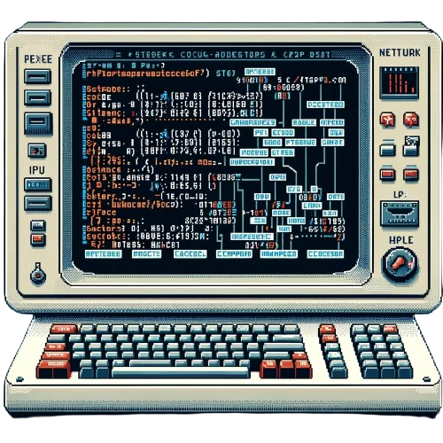

# Cleaker
Connecting all points within a fixed distance. **Cleaker** is a pronoun representing a [person](https://suign.github.io/this.me/), place, or thing in space and time. By defining namespaces based on Cleaker instances, you ensure that each namespace is unique, identifiable, and contextual to the specific [user](https://suign.github.io/this.me/), thus facilitating seamless and meaningful interactions within the network.

##### What is cleaker? [click here](https://suign.github.io/pages/cleaker.html).

## Install with npm.
```bash
npm i cleaker
```

# Basic Usage
**Importing Cleaker**: Import the Cleaker class by requiring it from where it's defined.

```js
const Cleaker = require('cleaker');
```

---------------------------------------------------


[namespaces](NameSpaces.html)

[neurons.me](https://www.neurons.me)
[neurons.me/this](https://www.neurons.me/this)

## Contributing
If you have suggestions or issues, please open an issue. We encourage contributions from the community.
## License & Policies
- **License**: MIT License (see LICENSE for details).
- **Privacy Policy**: Respects user privacy; no collection/storage of personal data.
- **Terms of Usage**: Use responsibly. No guarantees/warranties provided. [Terms](https://www.neurons.me/terms-of-use) | [Privacy](https://www.neurons.me/privacy-policy)
